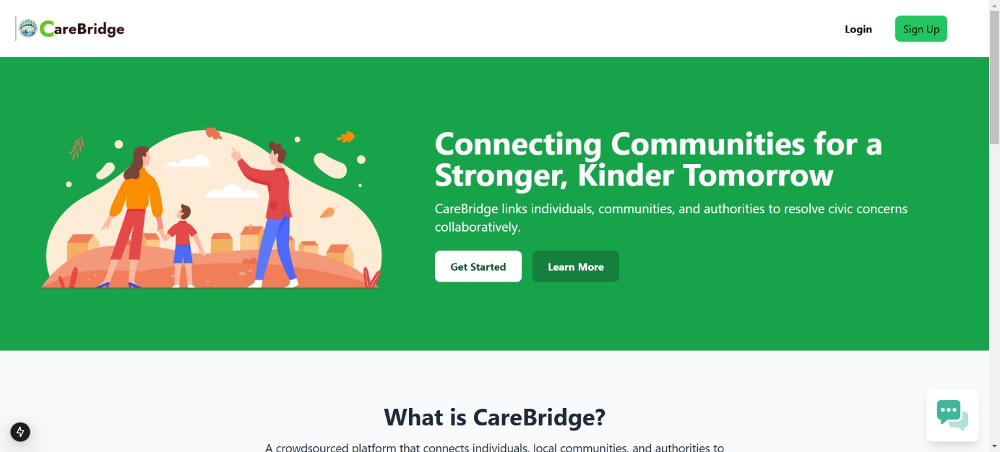
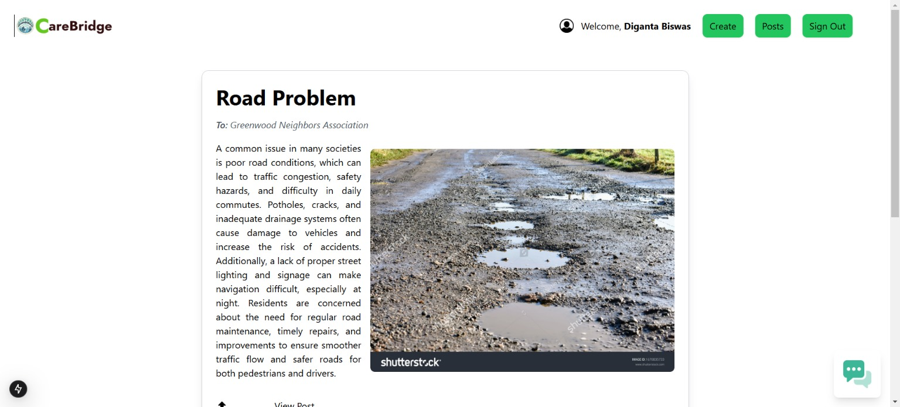
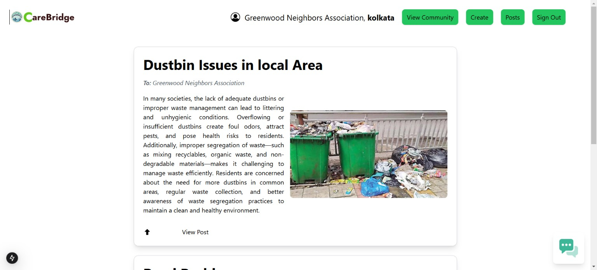
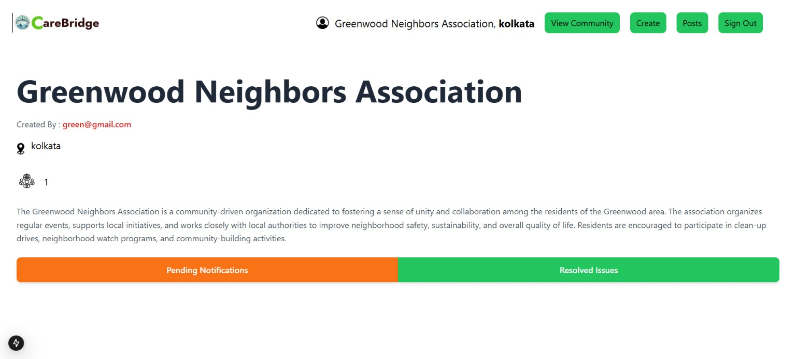

# CareBridge

CareBridge is a crowdsourced platform designed to connect individuals, communities, and authorities to collaboratively address civic concerns. It fosters collaboration, transparency, and accountability, enabling positive change in localities through community-driven solutions.

---

## Key Features

### 1. Post and Report Generation System
- Raise issues by creating detailed posts with images and descriptions.
- Tag relevant authorities to ensure issues are directed to the right parties.
- Track resolutions in real-time via a progress bar.

### 2. Community-Based System
- Collaborate with local or municipal bodies to address area-specific issues.
- Transparent tracking of ongoing issues and their resolution status.
- Showcase resolved issues to highlight community success stories.

### 3. AI-Based Content Filtration and Recommendation
- **Text Content Filtering**: Detect inappropriate language in posts and highlight it for user review.
- **Image Content Filtering**: Scan and flag graphic content, adding a "user discretion" tag if needed.
- **Post Recommendations**: Recommend related posts based on user activity.

### 4. One-to-One Chatbot
- Facilitate seamless communication between users and community members.
- Enable direct messaging for discussions, concerns, or collaborations.

---

## Application Workflow

1. Users create posts to raise concerns with details and images.
2. Authorities and admins review and resolve the issues.
3. Users track the progress in real-time.
4. Resolved issues are showcased to highlight positive community impacts.

---

## Technology Stack

- **Frontend**: Next.js, Tailwind CSS
- **Backend**: Node.js, Firebase, Socket.io
- **Database**: MongoDB
- **AI Models**: TensorFlow, Scikit-Learn
- **Deployment**: Vercel

---

## Team

- **Diganta Biswas** - Team Leader
- **Ronit Das**
- **Brandon Luke Williams**

## UI Interfaces 

